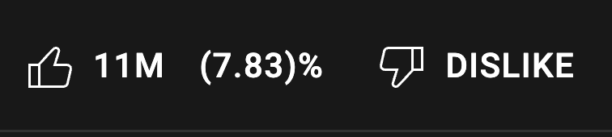

### youtube like to view ratio

This extension shows the like to view ratio for youtube videos.
A video with 1M views and 100 likes for example has a low ratio (0.1%), and probably means it does not worth your time.

Any video with a like to view ratio greater than 2 or 3 percent, should be all right.
The correct ratio however depends on the type of content you are watching.
  

<details>
<summary> <b>donate</b> </summary>
<p>

```
bitcoin: bc1qj78jrgsemj7qhgmht4gjmuwz3shrzk3evnv6kd
```

</summary>

</p>
</details>

<p></p>

- Install [Firefox Extension](https://addons.mozilla.org/firefox/addon/youtube-like-to-view-ratio/)
- Install [Chrome Extension](https://chrome.google.com/webstore/detail/youtube-like-to-view-rati/pjkjdnlpbfcociacjalpklkpebephmha)




